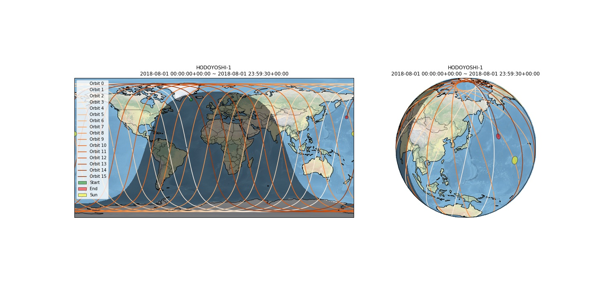

# Orbit simulator 🛰️

High precision satellite ground path simulation based on [skyfield](http://rhodesmill.org/skyfield/) library, using [SGP4](https://en.wikipedia.org/wiki/Simplified_perturbations_models) model.

**Features:**

- Generating ground path of existing satellites (from [NORAD database](http://celestrak.com/)) or custom satellites (defined using [orbital elements](https://en.wikipedia.org/wiki/Orbital_elements)
- Ground path is generated in two reference frames:
    - [GCS](https://en.wikipedia.org/wiki/Geographic_coordinate_system) (geographic coordinate system, lat/lon/elevation)
    - [ECI](https://en.wikipedia.org/wiki/Earth-centered_inertial) (Earth-centered intertial, X/Y/Z)
- Simulating position of the sun and day/night terminator line
- Calculating MLTAN
- Simulation results is stored in pandas DataFrame and can be easily exported to CSV file
- Generating animations


## Usage

```python
from skyfield.api import load
from ground_path import ground_path
from datetime import datetime

resource_url = 'http://celestrak.com/satcat/tle.php?CATNR=40299'
fname = 'tle_hodoyoshi_1.txt'
satellites = load.tle(resource_url, filename=fname, reload=False)
satellite = satellites['HODOYOSHI 1']
print(satellite)

# generate ground path
date_from = datetime(2018,8,1,0,0,0,0)
date_to = datetime(2018,8,2,0,0,0,0)
freq = 30 # generate data point every 30 seconds
df = ground_path(satellite, date_from, date_to, freq)
df.head()
```

| datetime                  | X          | Y            | Z           | lat       | lon        | elevation  | ascending | orbit |
| ------------------------- | ---------- | ------------ | ----------- | --------- | ---------- | ---------- | --------- | ----- |
| 2018-08-01 00:00:00+00:00 | 554.203355 | -3178.014692 | 6054.771852 | 62.118186 | -29.613950 | 499.094947 | True      | 0     |
| 2018-08-01 00:00:30+00:00 | 459.746660 | -2995.194778 | 6154.700398 | 63.944699 | -30.921147 | 499.336186 | True      | 0     |
| 2018-08-01 00:01:00+00:00 | 364.781322 | -2809.061221 | 6247.800731 | 65.759775 | -32.392397 | 499.569012 | True      | 0     |
| 2018-08-01 00:01:30+00:00 | 269.412421 | -2619.820087 | 6333.969878 | 67.560777 | -34.066235 | 499.791700 | True      | 0     |
| 2018-08-01 00:02:00+00:00 | 173.745475 | -2427.680857 | 6413.112555 | 69.344170 | -35.993558 | 500.002625 | True      | 0     |




## Other examples

- [1_ground_path_simulation.ipynb](./1_ground_path_simulation.ipynb)
- [2_visualization.ipynb](./2_visualization.ipynb)
- [3_animation.ipynb](./3_animation.ipynb)
- [4_custom_satellites.ipynb](./4_custom_satellites.ipynb)
- [5_MLTAN.ipynb](./5_MLTAN.ipynb)

## Sources

- https://en.wikipedia.org/wiki/Simplified_perturbations_models
- http://rhodesmill.org/skyfield/
- https://en.wikipedia.org/wiki/Terminator_%28solar%29
- https://github.com/SciTools/cartopy
